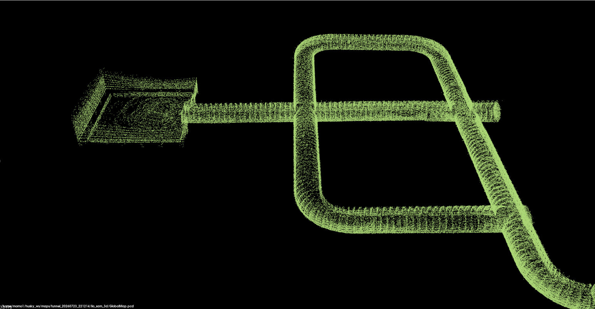
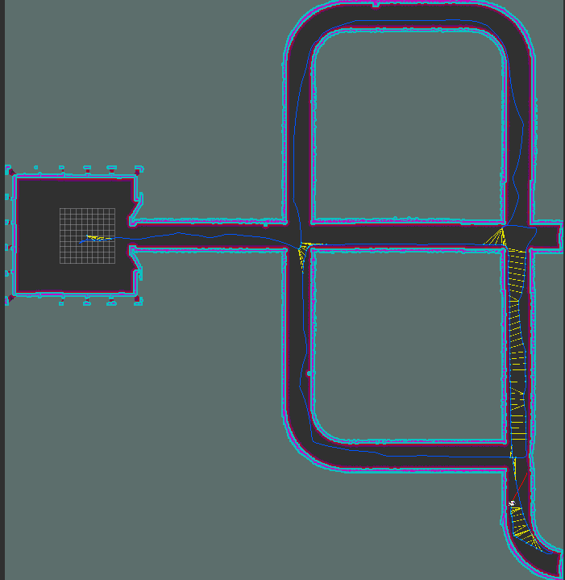

# Autonomous Mobile Robot for Tunnel Inspection

I built this ROS 2 simulation project as part of my Autonomous Mobile Robotics
course at the University of Waterloo. The goal is to develop a Clearpath Husky
that can enter an unknown tunnel, explore it autonomously, and build 2D and 3D
maps in real time.

The project combines a Husky A200, simulated 3D LiDAR and IMU, LIO-SAM, SLAM
Toolbox, Navigation2, and a custom C++ exploration node.

## Current status

The main mapping and navigation pipeline is working:

- The robot spawns without a predefined map.
- LIO-SAM generates a registered 3D point-cloud map and trajectory.
- SLAM Toolbox builds the live 2D occupancy map used for navigation.
- Navigation2 plans routes and avoids mapped obstacles.
- My C++ explorer selects reachable frontiers and sends navigation goals.
- The complete simulation can be started with one launch command.

The robot can autonomously map most of the tunnel network. I am currently
improving the final stage of exploration: filtering small false “unvisited”
regions, handling goals close to walls, recognizing true completion, and
returning to the starting position.

## Mapping results

### LIO-SAM 3D map



### SLAM Toolbox 2D map



## System overview

| Component | Purpose |
|---|---|
| Gazebo Fortress | Tunnel and Husky simulation |
| 3D LiDAR and IMU | Simulated perception and motion measurements |
| LIO-SAM | LiDAR-inertial odometry and 3D mapping |
| SLAM Toolbox | Live 2D occupancy mapping |
| Navigation2 | Planning, control, and obstacle avoidance |
| C++ exploration node | Frontier selection and coverage backtracking |
| RViz | Map, trajectory, costmap, and path visualization |

The 2D and 3D mapping pipelines run together. SLAM Toolbox supplies the map used
by Navigation2, while LIO-SAM independently produces the detailed 3D map.

## Tested environment

- Ubuntu 22.04 under WSL2
- ROS 2 Humble
- Gazebo Fortress
- Clearpath Husky A200 simulation
- Navigation2
- SLAM Toolbox
- LIO-SAM with GTSAM and PCL

## Quick setup on a new computer

### Requirements

- Ubuntu 22.04
- ROS 2 Humble Desktop
- A computer with enough RAM and preferably a dedicated GPU
- Git

Clone the complete autonomous-exploration branch:

```bash
cd ~

git clone \
  --branch feature/autonomous-exploration \
  --single-branch \
  --recurse-submodules \
  https://github.com/mohamadalquraan99-arch/husky-lio-sam-tunnel-inspection.git \
  husky_ws
```

Install the dependencies and build the workspace:

```bash
cd ~/husky_ws

chmod +x scripts/install_dependencies.sh
./scripts/install_dependencies.sh
```

Launch the complete project:

```bash
source /opt/ros/humble/setup.bash
source ~/husky_ws/install/setup.bash

ros2 launch husky_tunnel_bringup \
  tunnel_backtracking_exploration.launch.py
```

The launch command starts:

- Gazebo Fortress
- Clearpath Husky A200
- 3D LiDAR and IMU bridges
- LIO-SAM 3D mapping
- SLAM Toolbox 2D mapping
- Navigation2
- RViz
- The C++ autonomous tunnel explorer

### Updating an existing clone

```bash
cd ~/husky_ws
git pull
git submodule update --init --recursive
source /opt/ros/humble/setup.bash
colcon build --symlink-install
source install/setup.bash
```

## Clone and build

```bash
git clone --recurse-submodules \
  https://github.com/mohamadalquraan99-arch/husky-lio-sam-tunnel-inspection.git \
  husky_ws

cd husky_ws
source /opt/ros/humble/setup.bash
colcon build --symlink-install
source install/setup.bash
```

If the repository was cloned without its submodules:

```bash
git submodule update --init --recursive
```

The simulator-specific LIO-SAM and Clearpath compatibility changes are kept in:

```text
src/husky_tunnel_bringup/patches/
```

## Run autonomous exploration

```bash
source /opt/ros/humble/setup.bash
source ~/husky_ws/install/setup.bash

ros2 launch husky_tunnel_bringup \
  tunnel_backtracking_exploration.launch.py
```

This starts Gazebo, the Husky and sensor bridges, LIO-SAM, SLAM Toolbox,
Navigation2, RViz, and the C++ tunnel explorer.

To launch mapping and Navigation2 without autonomous movement:

```bash
ros2 launch husky_tunnel_bringup tunnel_live_nav2.launch.py
```

## Save the maps

Keep the simulation running and use another terminal:

```bash
source /opt/ros/humble/setup.bash
source ~/husky_ws/install/setup.bash

MAP_DIR="$HOME/husky_ws/maps/tunnel_run_01"
mkdir -p "$MAP_DIR"

ros2 run nav2_map_server map_saver_cli \
  -f "$MAP_DIR/tunnel_2d" \
  --ros-args \
  -p use_sim_time:=true

ros2 service call \
  /lio_sam/save_map \
  lio_sam/srv/SaveMap \
  "{resolution: 0.0, destination: '${MAP_DIR}/lio_sam_3d'}"
```

Use a new run directory each time to avoid overwriting previous results.

## Main project files

```text
src/husky_tunnel_bringup/
├── config/
│   ├── exploration_nav2.yaml
│   ├── exploration_slam.yaml
│   ├── tunnel_backtracking.yaml
│   └── tunnel_no_spin_wait.xml
├── launch/
│   └── tunnel_backtracking_exploration.launch.py
├── src/
│   └── tunnel_backtracking_explorer.cpp
├── patches/
└── worlds/
    └── tunnel.sdf
```

The active exploration implementation is:

```text
src/husky_tunnel_bringup/src/tunnel_backtracking_explorer.cpp
```

## Useful topics

| Data | Topic |
|---|---|
| Velocity command | `/a200_0000/cmd_vel` |
| Wheel odometry | `/a200_0000/platform/odom` |
| IMU | `/a200_0000/sensors/imu_0/data` |
| Raw 3D LiDAR | `/a200_0000/sensors/lidar3d_0/points` |
| Live 2D map | `/map` |
| Navigation plan | `/plan` |
| LIO-SAM odometry | `/lio_sam/mapping/odometry` |
| Registered 3D cloud | `/lio_sam/mapping/cloud_registered` |
| LIO-SAM global map | `/lio_sam/mapping/map_global` |

## Next steps

- Make coverage completion ignore insignificant map artifacts
- Return the robot to its recorded starting pose after exploration
- Improve navigation clearance near tunnel walls
- Save and compare repeatable mapping runs
- Add inspection targets and defect reporting
- Validate the pipeline on physical hardware

## Acknowledgements

This project builds on
[LIO-SAM](https://github.com/TixiaoShan/LIO-SAM),
[Navigation2](https://github.com/ros-navigation/navigation2), and the
[Clearpath Robotics](https://github.com/clearpathrobotics) ROS 2 packages.

This is an educational simulation project and not an official Clearpath or
LIO-SAM distribution.
